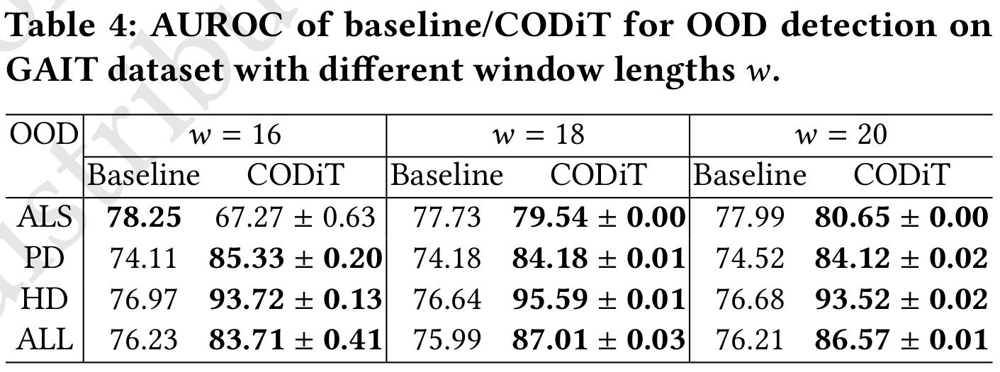

# The following instructions for generating results (Table 4) on GAIT dataset. This code has been tested on a server with GPUs.

## Step 1: Download gait-in-neurodegenerative-disease-database-1.0.0 folder from https://drive.google.com/drive/folders/1Z-3YnlhcCxI_KlFF6FF7tMp5MSEZURRH?usp=sharing
### Note: rename the downloaded folder to gait-in-neurodegenerative-disease-database-1.0.0.zip
    mkdir data
    mv gait-in-neurodegenerative-disease-database-1.0.0.zip data/.
    cd data
    unzip gait-in-neurodegenerative-disease-database-1.0.0.zip
    cd ../

## Step 2: Download the three trained models (gait_16.pt, gait_18.pt, gait_20.pt) from https://drive.google.com/drive/folders/1p0F2D3oTUgB3QKq_0uLu1F9eKRzRibml?usp=sharing
    mkdir saved_models
    mv gait_16.pt saved_models/.
    mv gait_18.pt saved_models/.
    mv gait_20.pt saved_models/.

## Step 3: Setting up the environment: Two options here : (1) Docker,or (2) Conda. You can work with either of these two options.

### This step is for seting up the Docker environment: takes ~50-60 minutes.

1. install [Docker](https://docs.docker.com/get-docker/) on your machine 
2. To build a docker image: `docker build -t codit .`  
3. To run the docker container and open an interactive session with docker: `docker run -i -t --gpus all --name temp_test --rm codit /bin/bash`

After finishing the experiments, to leave the docker environment, 
run `exit`  

### This step is for generating Conda environment.
    conda create --name gait python=3.6.13
    conda activate gait
    pip install -r requirement.txt
    
## Step 4: Generate CODiT results in Table 4 after populating the command-line arguments: --ckpt=saved_models/gait_$wl$.pt where wl = 16/18/20, --wl=16/18/20 (same as wl in saved_models/gait_$wl$.pt), and --disease\_type=als/park/hunt/all

### park is for PD, hunt is for HD

The expected result, i.e., Table 4 in the paper is 

### Note: The following results will be generated for just 1 run. In the paper, we ran these experiments 5 times (with different seeds) and reported the mean and standard deviation (std). The results with 1 run are similar to those reported in paper. 

### It takes ~12-15 minutes to run for "all" as OOD data, and ~8-10 minutes for "als/park/hunt" as OOD data.

    mkdir gait_log
    python check_OOD_gait.py --save_dir gait_log/ --ckpt saved_models/gait_$wl$.pt  --transformation_list high_pass low_high high_low identity --wl $wl$ --cuda --gpu 0 --n 100 --disease_type $disease_type$
    
## Generate baseline results in Table 4 with --wl=16/18/20, --disese\_type=als/hunt/park/all
    python check_OOD_baseline.py --disease_type $disease_type$ --wl $wl$ --root_dir data/gait-in-neurodegenerative-disease-database-1.0.0

## (optional) Training VAE model on GAIT dataset on wl=16/18/20
    python train_gait.py --log saved_models --transformation_list high_pass low_high high_low identity --wl $wl$

